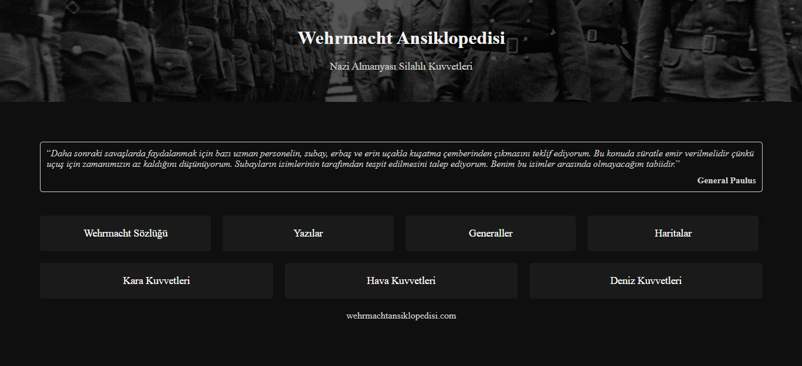
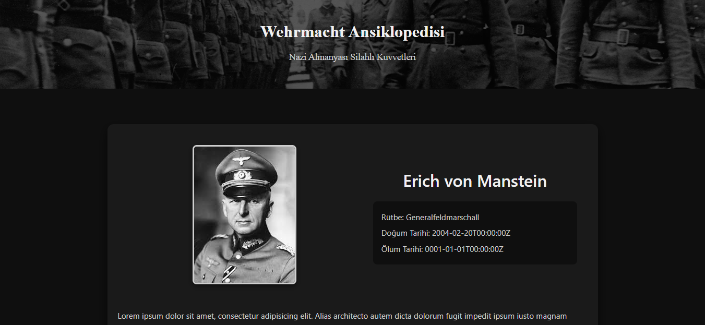
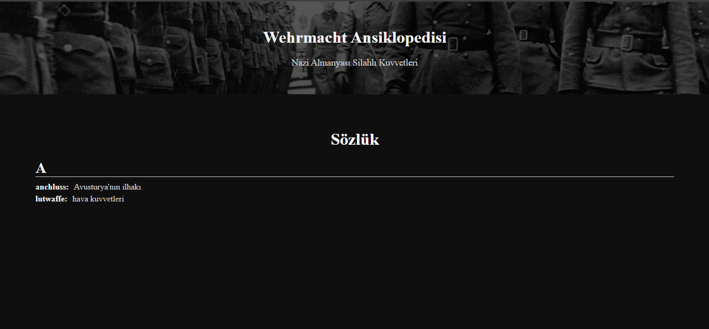
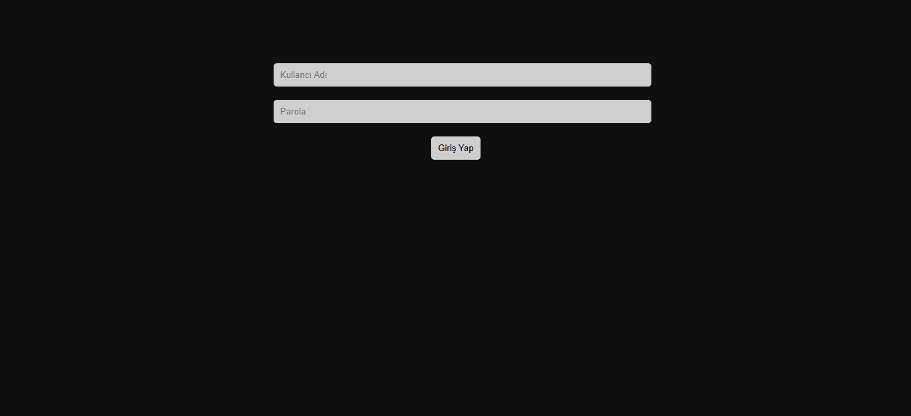
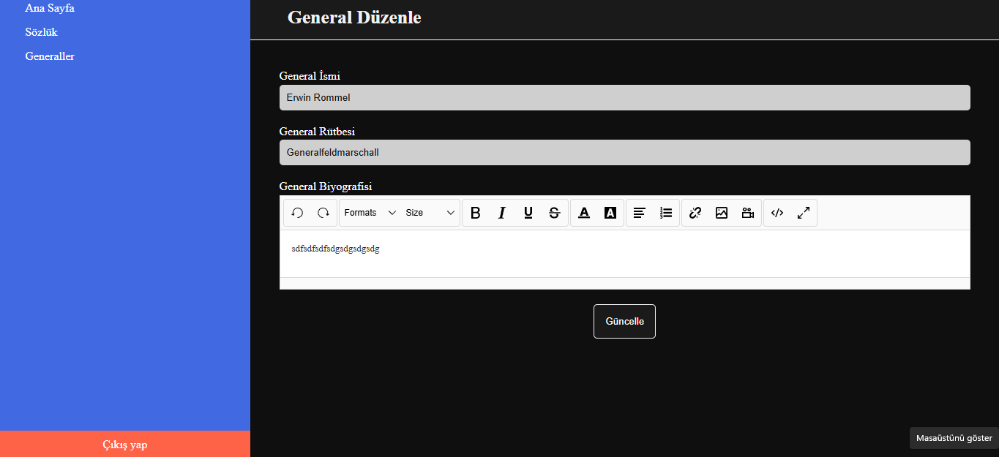

# Wehrmacht 

BİLGİLENDİRME: Bu proje, tarihsel bir araştırma ve arşiv çalışmasıdır.
Amacı; II. Dünya Savaşı dönemindeki askeri, siyasi ve toplumsal gelişmeleri ele almak, belgeleri derlemek ve bilgiyi düzenli bir şekilde sunmaktır.

Önemle belirtmek gerekir ki bu projenin geliştirilme amacı:

* Nazi sempatizanlığı yapmak,
* SS katliamlarını övmek,
* Irkçılığı veya ayrımcılığı teşvik etmek

KESİNLİKLE DEĞİLDİR.

Projenin tek hedefi, tarihsel verilerin nesnel, tarafsız olarak aktarılmasıdır.

